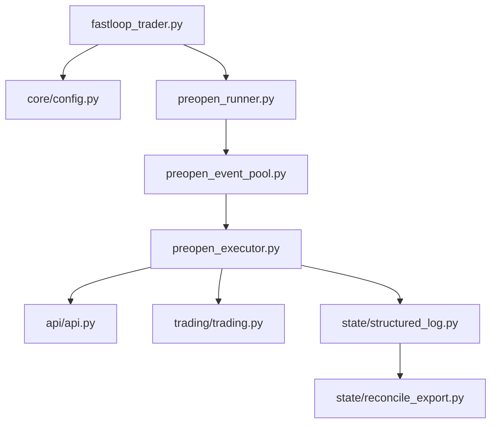

# 双钱包事件交易流程重设计

## 目标

- 将当前基于单策略的 preopen 流程，重构为“事件级生命周期 + 双钱包协同执行”的独立业务流程。
- 先实现固定价卖出与强平规则，确保流程稳定、日志完整、风控清晰。
- 公共能力继续复用现有 API、配置、通知、结构化日志和结算查询；业务逻辑集中在新流程层，避免耦合到旧状态机里。

## 当前代码的主要流程梳理

- 入口在 `[main/fastloop_trader.py](main/fastloop_trader.py)`，根据 `strategy_mode` 选择 preopen 或 oracle-latency 流程。
- 市场发现和事件池在 `[main/preopen_runner.py](main/preopen_runner.py)` 与 `[main/preopen_event_pool.py](main/preopen_event_pool.py)`。
- 交易执行与撤单封装在 `[main/preopen_executor.py](main/preopen_executor.py)`、`[trading/trading.py](trading/trading.py)`、`[api/api.py](api/api.py)`。
- 结构化结果落盘在 `[state/structured_log.py](state/structured_log.py)`，结算/收益导出在 `[state/reconcile_export.py](state/reconcile_export.py)`。
- 配置入口集中在 `[core/config.py](core/config.py)`。

## 建议的新架构

- 保留公共基础设施层：
  - `[api/api.py](api/api.py)`：下单、撤单、订单查询、结算查询。
  - `[trading/trading.py](trading/trading.py)`：执行封装、账户能力、订单类型转换。
  - `[state/structured_log.py](state/structured_log.py)`：继续负责结构化落盘，但扩展事件字段。
  - `[core/config.py](core/config.py)`：新增双钱包与固定卖价配置。
- 新增独立业务层：
  - 双钱包事件协调器：负责一个事件从入场、部分成交、撤单、挂卖、强平、结算到汇总的完整生命周期。
  - 订单生命周期服务：只处理单笔订单/单腿订单状态变化，不夹杂风控和汇总逻辑。
  - 事件收益聚合器：汇总两个钱包在单事件上的总收益，并输出最终结果。
  - 连亏停机守卫：连续亏损 2 个事件后立即停止后续交易。

## 新流程设计

### 1. 入场阶段

- 对每个可交易事件，同时使用两个不同钱包：
  - 钱包 A 下 `UP`
  - 钱包 B 下 `DOWN`
- 记录统一日志字段：
  - 账号
  - 事件名称
  - 订单类型：`UP` / `DOWN`
  - 订单金额
  - 操作类型：`挂单`
  - 操作时间：`MM月XX日 HH:mmss`
- 建议把“操作日志”从纯文本打印升级为结构化事件记录，便于后续回放和报表。

### 2. 部分成交处理

- 在配置的 `X` 秒窗口内判断成交情况。
- 如果出现“一单成交、另一单未成交”：
  - 立即撤销未成交订单
  - 记录未成交订单的“取消挂单”日志
  - 对已成交订单立即挂卖单到固定价格 `XX¢`
  - 记录“挂卖”日志
- 这一段建议拆成一个独立的 `partial_fill_handler`，不要写进主循环里。

### 3. 强平兜底

- 若订单一直没有成交、也没有被吃单：
  - 在距离收盘 30 秒或 40 秒时强制平仓
  - 记录“平仓”日志
  - 日志必须包含平仓价格
- 固定卖价方案下，强平价格先采用固定策略参数，后续再抽象成可插拔定价器。

### 4. 事件结果汇总

- 记录最终结果为 `UP` 或 `DOWN`。
- 汇总两个钱包在当前事件的总收益。
- 输出事件级 summary，包含：
  - 订单数
  - 成交数
  - 撤单数
  - 平仓数
  - 总收益
  - 是否盈利

### 5. 连亏停机

- 按事件维度统计盈亏。
- 连续亏损 2 次事件后，触发全局停机标记。
- 停机信号应由风控层控制，不应散落在多个执行函数里。

## 适合新增的模块边界

- 新增 `event_cycle/` 或 `strategy/` 下的独立流程模块，避免继续扩展旧的 `preopen_executor.py`。
- 新增“订单状态模型”和“事件结果模型”，将业务对象显式化，减少字典传递。
- 将日志格式器与执行器分离，保证打印和业务动作不互相依赖。
- 将“卖出价格策略”抽象为单独定价器，当前先实现固定价，后续可以替换为动态计算。

## 固定价 vs 动态价的落地建议

- 第一阶段：固定价。
  - 优点是实现快、可控、容易验证。
  - 适合先验证你的双钱包闭环、撤单、挂卖、强平和停机规则。
- 第二阶段：动态价。
  - 根据成交价、剩余时间、盘口深度、事件波动自动计算卖价。
  - 更灵活，但要单独拆出定价接口，不能直接写死在执行器里。
- 结论：先固定价，等流程和数据稳定后，再把卖价策略替换成可插拔组件。

## 需要修改的重点文件

- `[main/fastloop_trader.py](main/fastloop_trader.py)`
  - 增加新策略入口或策略模式切换。
- `[core/config.py](core/config.py)`
  - 增加双钱包、超时、固定卖价、连亏停机配置。
- `[state/structured_log.py](state/structured_log.py)`
  - 增加双钱包事件字段、操作类型、平仓价格、最终汇总字段。
- `[trading/trading.py](trading/trading.py)`
  - 拆出更细粒度的下单/撤单/卖单接口，支持两个钱包独立执行。
- `[api/api.py](api/api.py)`
  - 确认撤单、订单查询和结算接口能支持新流程。
- `[state/reconcile_export.py](state/reconcile_export.py)`
  - 将导出维度从“单笔交易”升级为“事件级汇总 + 双钱包明细”。

## 实施顺序

1. 先定义新流程的数据模型和事件状态机。
2. 再把公共执行能力拆成可复用接口。
3. 然后接入双钱包入场、部分成交、撤单、挂卖、强平。
4. 最后补事件结果汇总、连续亏损停机和结构化报表。

## 验收标准

- 同一事件能以两个不同钱包独立执行 `UP` / `DOWN`。
- 发生单边成交时，另一边能及时撤单并切换到卖出逻辑。
- 无成交事件能在收盘前固定时间强平。
- 每次操作都能落下统一格式日志。
- 连续亏损 2 次后能停止后续交易。
- 业务逻辑不和公共 API、日志、配置强耦合。

